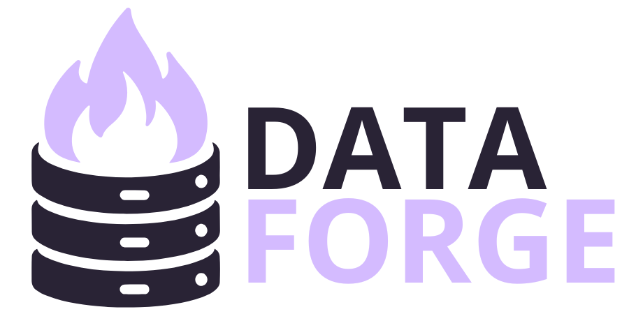

# 📊 Data Forge

<p align="center">
  
  <br>
</p>


**Fully Dockerized Data Engineering Portfolio Project**  
*Following the Medallion Architecture (Bronze → Silver → Gold)*

This project simulates a real-world ETL pipeline using Spark, PostgreSQL, Trino, Airflow, and Jupyter — all orchestrated with Docker Compose.

---

## 🧱 Architecture Overview

- **Bronze Layer**: Raw JSON stored locally
- **Silver Layer**: Cleaned & normalized data in PostgreSQL (dev/prod schemas)
- **Gold Layer**: BI-ready Parquet datasets queried via Trino
- **Tools**: Spark, Jupyter, Trino, Airflow, PostgreSQL

---

## 🌐 Service Access (Localhost URLs)

| Service          | URL                             | Description                     |
|------------------|----------------------------------|---------------------------------|
| **Airflow**      | [localhost:8080](http://localhost:8080) | Workflow orchestration         |
| **Trino**        | [localhost:8088](http://localhost:8088) | SQL query engine for Parquet   |
| **Jupyter Lab**  | [localhost:8888](http://localhost:8888) | Notebook-based dev environment |
| **Spark Master** | [localhost:8082](http://localhost:8082) | Spark Web UI                   |
| **Spark Worker** | [localhost:8081](http://localhost:8081) | Worker node monitoring         |
| **Docker API**   | [localhost:2376](http://localhost:2376) | Proxy access to Docker socket  |

---

## 🛠️ Project Initialization

### ▶️ Start All Services

```bash
 make -f .makefile compose-up
```

This will:

* Create a shared Docker network (`ndsnet`)
* Launch all containers in detached mode
* Fix permissions on Docker socket and Trino configs

Note: If you get the error 
```bash
Error response from daemon: network with name ndsnet already exists
```

run
```bash
docker network rm ndsnet
```

### ⛔ Stop All Services

```bash
 make -f .makefile compose-down
```

This will:

* Stop and remove containers
* Remove the `ndsnet` network

---


## 📁 Folder Structure (Essential)

```bash
.
├── airflow/              # DAGs, logs, plugins
├── etl/
│   ├── bronze/           # Raw input JSONs
│   └── gold/             # Final Parquet tables
├── jupyter/              # Jupyter Dockerfile + notebooks
├── robots/               # Optional custom service
├── spark/src/            # Spark ETL jobs
├── trino/etc/            # Config files + catalog definitions
├── Makefile
└── docker-compose.yaml
```

---

## 📄 Project Maintainer
Sara Fernandez - saradfrz@gmail.com
