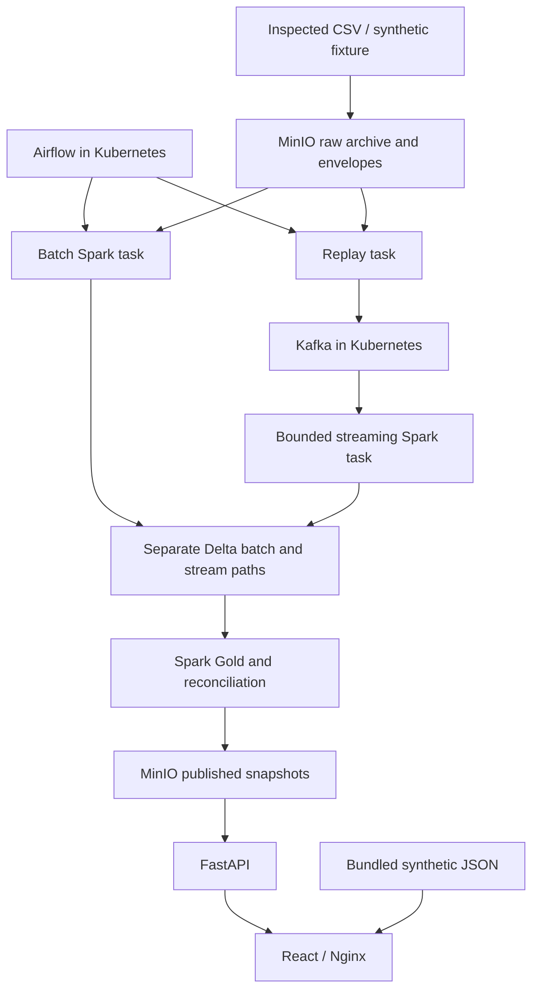

# Data Forge — Product, Architecture and Delivery Report

**As of 8 October 2026 · Revision 2 · Owner: Sara Fernandez, one developer using AI.**

The project formerly named TickStream Lakehouse is now **Data Forge**. The requested report filename is retained for continuity. This revision supersedes the earlier architecture: **Kubernetes, Airflow, MinIO, Kafka, Spark/Delta, FastAPI and React** form the active stack. Databricks and dbt belong to a separate future project built around a single uploaded CSV; they are not dependencies or optional execution paths in Data Forge.

This report accompanies the `Data_Forge.zip` implementation. It distinguishes supplied code, executed validation and future work. It does not claim that deployment manifests have been tested in a Kubernetes cluster.

## 1. Product definition

Data Forge is an educational FX quote analytics platform designed to demonstrate reproducible ingestion, medallion architecture, event-time reasoning, orchestration, object storage, data quality, reconciliation and delivery. Its main audience is data engineering hiring managers and technical reviewers; its secondary audience is a developer learning financial market data.

The problem is that apparently sensible charts can conceal wrong price scaling, timestamp-tie losses, repeated deliveries, missing intervals and inconsistent batch/stream results. Data Forge makes those decisions explicit and auditable. No trading, portfolio management or investment recommendations are required.

### User journeys

| Journey | Outcome | Portfolio evidence |
|---|---|---|
| Bootstrap the local lab | All runtime services execute in a dedicated kind cluster | Kubernetes manifests, resources, PVCs, secrets and service discovery |
| Import a dataset | Original bytes and row lineage survive transformations | Immutable manifest, checksum, normalized envelopes |
| Replay historical observations | Kafka transports the same input on a controlled schedule | Speed/rate controls, pause/resume, acknowledged checkpoints |
| Compare processing paths | Final batch and stream outputs agree for the same source | Event-set and metric reconciliation reports |
| Explain a chart | Its units, sampling, gaps and limitations are visible | Finance guide, source traceability, numerical fixtures |
| Review without infrastructure | Synthetic dashboard remains useful offline | Static JSON preview with honest status labels |

### Scope and measurable acceptance

**Implemented v0.1 code scope:** one canonical CSV per dataset; synthetic fixture; raw archive in MinIO; independent batch/Kafka ingestion; Delta Bronze, Silver and quarantine; Spark financial tables; bounded reconciliation; Airflow DAG; local API; React preview and Kubernetes deployment recipes.

**Next delivery gate:** execute the complete DAG in the user's local Kubernetes cluster. No source or cluster credentials are needed to run the synthetic scenario.

**Acceptance targets:** every canonical source row is accepted or quarantined; event IDs survive retries and timestamp ties; final path metrics meet comparison tolerances; a failed run preserves the last good publication; no paid service is required; frontend contains no credentials; first synthetic DAG completes under 40 minutes per task on the recorded hardware. Measure actual latency/memory before setting a throughput promise.

**Definition of done for v0.1:** unit/API/Spark semantic tests pass, images build, pods become ready, two DAG runs complete with different run IDs, retrying a stage changes no analytical result, reconciliation passes, cluster snapshot appears in React, and a restart/PVC recovery test passes. The code archive currently satisfies only the validation items recorded in `docs/VALIDATION.md`; cluster gates remain open.

**Later:** 8–10 pairs, multi-file source catalogs, 2M-record stress runs, continuous processing, watermark state management, late-event revisions, market calendars, complete-day certification, richer operational telemetry and optional distributed Spark executors.

**Non-goals:** production high availability, public Kubernetes exposure, order execution, paid hosting, ML, trade-volume indicators and the separate Databricks/dbt project.

## 2. Evidence, feasibility and stack choices

Labels used here: **Verified** means official documentation supports the statement; **Implemented** means code exists; **Tested** means an execution result is recorded; **Estimate** means unbenchmarked planning arithmetic; **Unresolved** means a sample/account/runtime check is still required.

### Current source findings

- **Verified:** Dukascopy describes free historical tick CSV export [S1]. Actual selected exports, field names, datetime format and unit details still require inspection. Automatic downloading is not implemented; free manual CSV import is the baseline.
- **Verified:** its bulk-data guide describes a requester-pays route [S2]. That acquisition route is excluded. A free download tool does not make all bulk endpoints free.
- **Unresolved:** 8–10 pairs producing 2M ticks per day. This is a workload target, not a guaranteed provider yield.
- **Unresolved:** Finnhub's free FX websocket entitlements and a compatible bid/ask schema. It remains outside this project [S3].
- **Unresolved:** redistribution rights for real raw and derived provider data. Public demonstrations default to synthetic data [S4].

### Tool comparison

| Tool or option | Role | Free-tier restrictions | Integration feasibility | Resource requirements | Recommendation |
|---|---|---|---|---|---|
| kind / Kubernetes | Local runtime for every service and data job | No mandatory hosted service; local resources only | Docker-backed single-node cluster [K1] | Estimate 1–2 GB control-plane overhead | Primary lab runtime |
| Airflow 3.3.2 | Bounded orchestration | Open source; operate it locally | LocalExecutor in Airflow pod, KubernetesPodOperator for application tasks [K2] | Limit 2 GB Airflow memory | Primary, development standalone mode |
| PostgreSQL 16 | Airflow metadata | Local open-source deployment | Airflow SQLAlchemy connection via Kubernetes Secret [K3] | Limit 512 MiB initially | Metadata only |
| Kafka 3.9.1 | Replay transport | Single broker, no HA, bounded retention | Official Apache image; in-cluster service [K4] | Limit 1 GiB, 8 GiB PVC | Primary transport |
| MinIO Community | S3-compatible persistent storage | Archived, source-only community distribution; AGPLv3 [K5] | Pinned source build; S3A and boto3 clients | Limit 1 GiB, 20 GiB PVC | Requested local lab component; not a maintained production-service claim |
| Spark 3.5.6 + Delta 3.3.2 | Typed transformations, lakehouse tables and metrics | Local hardware; matching connector versions needed [K6] | Spark `local[2]` inside each task pod | Limit 5 GiB per task; one at a time | Primary engine |
| Plain Parquet | Portable analytical export | No transaction log or atomic table versioning by itself | Spark writes snapshot export directories | Disk bound | Export, not mutable canonical storage |
| FastAPI | Read-only JSON serving | Backend must be running for dynamic mode | Reads latest published object from MinIO | Limit 512 MiB | Primary local API |
| React / Nginx | Dashboard | Static UI alone cannot query private MinIO | Same-origin API proxy; bundled JSON alternative | Web pod 128 MiB | Primary UI |
| Streamlit | Optional exploratory BI | Local process/resources; not required | Could read authorized Parquet | Additional process | Defer until core workflow is reliable |
| Metabase + another database | Optional BI | Extra services and loading pipeline | Possible Gold export into PostgreSQL | Extra memory/operations | Omit MVP |
| Hosted Kafka/cloud Kubernetes | Remote execution | No free continuous cluster assumed | Not necessary for reproduction | Provider-dependent | Excluded from active architecture |
| Databricks + dbt | Separate single-CSV project | Free Edition constraints remain relevant there | No connection to this codebase | Separate planning | Explicitly removed |

Selected direct dependency versions are pinned; npm has a lockfile and Airflow installation uses its official constraints. Image tags, OS indexes and Maven artifacts are not yet locked by digest. Record successful image digests after first deployment. These are compatible baseline choices, not assertions of current security support for every pinned version.

MinIO's official repository is archived and says it is no longer maintained. The release page provides a source install for `RELEASE.2025-10-15T17-29-55Z` [K5]. The build recipe uses that release, not an invented current community container tag or a paid replacement. Keep the lab local, preserve required license notices and review maintenance risk before any future external deployment.

### Primary architecture

All runtime nodes are Kubernetes pods. The operator runs local commands to create the cluster and build/load images. PostgreSQL supports Airflow metadata; it does not store quotes. MinIO holds raw data, manifests, Delta tables, checkpoints and exports. Kafka has a PVC but is not the long-term archive.

Spark `local[2]` within a pod uses two local worker threads. This demonstrates Kubernetes packaging and orchestration, not a distributed Spark executor topology. Distributed Spark is a later change with a separate resource and permissions budget. Keeping one task active reduces memory contention on a personal laptop.

Airflow uses LocalExecutor for orchestration and KubernetesPodOperator for isolated stage pods. It is not configured as KubernetesExecutor. Airflow's `standalone` command runs development services together in one pod, backed by PostgreSQL. Split scheduler/API/dag processor and use an official Helm release if the operational scope expands.

### Local, hosted and public demonstration

- **Local execution:** the complete supported deployment target is kind. No cloud billing account is required.
- **Free hosted execution:** none is promised or required. A hosted always-on Kubernetes/Airflow/Kafka platform is outside the zero-cost assumption.
- **Public demonstration:** static React assets with synthetic JSON and a recorded run. Publishing is not performed by this task. Private service credentials never go in the browser.
- **Offline review:** bundled synthetic reference output works without a backend. Its reconciliation status is `not_run`; it is not fabricated evidence of a successful Kafka pipeline.

### Fallback

If the full stack exceeds laptop resources, use the supplied dependency-light import/domain tests and static preview to work on contracts and UI, then return to the same kind deployment for integration. This is a **development fallback**, not an alternative completed streaming platform. Do not claim Airflow/Kafka/Delta execution from a static preview. Reduce to one pair/hour, sequential tasks and a small fixture before dropping required components.

## 3. Starting code and framework integration

The supplied starter contains Spark medallion ETL, PostgreSQL integration, Jupyter notebooks and Docker Compose. Its workload is purchase/food categorization; that domain does not belong in the FX transformations.

Retained foundations: Data Forge naming, medallion directories, explicit schemas/casting, SparkSession configuration pattern and the Spark 3.5 family. PostgreSQL is repurposed for Airflow. Compose is replaced by Kubernetes. `docs/MIGRATION.md` maps old elements to new paths.

The framework's `config.py`, `directory.py`, `file.py`, `logger.py` and `string.py` are preserved. `main.py` retains its structure and fills the missing application import/call. Its original cleanup still deletes `config.dir.output_html` and `config.dir.logs`: these map to disposable local `output/session` and `logs`, never data/checkpoint/PVC paths. Do not invoke concurrent commands from one pod working directory. Durable data lives outside those paths.

The inherited logger name `invoice_pipeline` is retained to honor the explicit no-modification instruction. Airflow captures command output. The old supplied credentials, Docker socket proxy, broad chmod commands, notebook outputs and text-decoded PNG bytes are not included in the new code package.

## 4. Data and pipeline specifications

### Initial dataset and actual volume

First real-data gate: EUR/USD, 2026-09-15 12:00–13:00 UTC, subject to availability. Then include USD/JPY to verify different pip/price conventions. Scale study: 2026-09-07 through 2026-10-02, with verified coverage rather than assuming all weekdays are complete.

Basket: EUR/USD, GBP/USD, USD/JPY, USD/CHF, USD/CAD, AUD/USD, NZD/USD and EUR/GBP; optionally EUR/JPY and GBP/JPY. Describe it as majors and selected crosses. Count rows by pair/date, including accepted/quarantined records, missing files, observed time span, bytes and peak one-second update rate. Report median/p10/p90 across complete sampled days. Never duplicate rows and call the result natural market volume.

2M records/day averages 23.15 records/s across 24 hours. At 100× replay that averages 2,315/s before bursts. A 500-byte envelope implies roughly 1 GB/day uncompressed payload. These are estimates to measure, not achieved performance. v0.1 uses a 230-record synthetic fixture and bounded exports; the full target is a later benchmark.

### Source schema and import

Canonical input columns: `instrument,event_ts,bid,ask`, optionally `bid_volume_source,ask_volume_source`. Timestamps must contain a timezone. Prices are decimal strings. A configurable mapping adapts inspected headers and datetime formatting; no locale/timezone is guessed. Dataset ID binds to one immutable CSV checksum. One canonical CSV per dataset is an explicit v0.1 constraint; scalable multi-file backfill manifests are planned.

The importer preserves original bytes, SHA, original row index, raw parsed record and mapping settings. It emits envelopes in 10,000-row NDJSON chunks and publishes the manifest last. Retrying the same checksum/dataset is a no-op; changing bytes requires a new dataset ID.

For binary context, the Dukascopy guide documents uint32 time/ask/bid and float32 side-volume fields in 20-byte big-endian records, with format-specific time origins and price scaling [S2]. This version imports decimal CSV, not binary BI5, so **no BI5 price divisor is applied**. Verify the chosen CSV's precision and source volume units independently.

Dukascopy's quote-side volume is available liquidity at the corresponding best quote, not executed global turnover [S6]. Missing/unverified units stay labeled `unverified`. No VWAP or trade-volume metric is derived.

### Table and object contracts

| Dataset/object | Grain and fields | Key / rules |
|---|---|---|
| `raw/{dataset}/{sha}.csv` | Original bytes | Immutable source hash |
| `manifests/{dataset}.json` | Source hash, row count, chunks, mapping, synthetic flag, acquisition time | Dataset identity cannot silently change |
| `events/{dataset}/part-*.jsonl` | Versioned envelope, source row/order, raw record and expected quote fields | `event_id = SHA256([file_sha,row_index])` |
| Delta `bronze` | Raw transport payload, ingestion time, delivery ID, Kafka topic/partition/offset | Delivery ID identifies arrival, not market observation |
| Delta `silver` | Accepted ID, pair, UTC timestamp, source order, decimal bid/ask/mid/spread, source volumes/unit/flags | Unique event ID within each independent path |
| Delta `quarantine` | Raw payload, delivery ID, ingestion time and reason list | Retains invalid observations for inspection |
| `gold_candles` | Pair/window/basis/interval; OHLC, count, first/last IDs and last event time | `(instrument,window_start,interval_seconds,price_basis)` |
| `gold_spreads` | Pair/minute; count, spread sum/mean/min/max, pip and bps means | `(instrument,window_start)` |
| `gold_returns` | Minute close, predecessor boundary, simple/log return, age and gap flag | `(instrument,sample_end)` |
| `gold_volatility` | 60-return sample SD, counts and coverage | `(instrument,sample_end)` |
| `gold_daily_summary` | UTC day mid OHLC, count, spreads, open/close return, realized volatility and coverage | `(instrument,event_date)` |
| `runs/{run}/producer.json` | Acknowledged next source row and complete end-offset vector | Resume same source/run; completed run is immutable |
| `runs/{run}/consumer.json` | Consumed completion vector and output path | Must match producer cutoff |
| `runs/{run}/reconciliation.json` | Table differences, missing/extra counts and row accounting | Publish gate |
| `exports/{run}/snapshot.json` | Bounded JSON tables, generated time, source/run, truncation and status | Updated pointer only after successful export |

Source prices use `DECIMAL(20,10)`; midpoint preserves 11 fractional places so half an input increment survives. Supported input precision is at most 10 decimals; higher precision is quarantined, not silently rounded. Volumes are nullable doubles with invalid fields flagged.

Raw and event IDs are stable; Kafka redeliveries have distinct offsets but the same event ID. Timestamp ties are not duplicate keys. A repeated identical quote at a new row remains a distinct source observation. Overlapping exports must be curated into an approved canonical dataset before import; content equality does not prove duplication.

The envelope JSON schema is provided. The runtime validator checks required semantic fields/version and quarantines invalid payloads. New required meanings or timestamp units require a new schema version and explicit migration. The current importer owns identity generation; arbitrary external Kafka producers are not supported.

### Replay, ordering and time semantics

Replay key is instrument. v0.1 creates **one isolated topic and one partition per run**, simplifying the offset cutoff and order audit. End-to-end ordering uses `(event_ts, source_order, event_id)`, not Kafka arrival or ingestion time. The producer emits the canonical CSV order; it does not globally sort or simulate a multi-provider feed.

`--speed` scales positive event-time gaps; zero means burst mode with the `--rate` cap still enforced. Pause/resume uses a MinIO control object. The producer waits for broker acknowledgments, periodically saves source progress and can resend a tail after a crash. Silver merges event IDs to suppress redeliveries. Completion stores the broker end offsets.

The stream command consumes the completed isolated topic using Spark Structured Streaming `AvailableNow`, bounded per-trigger offsets and a durable checkpoint. Each micro-batch writes Bronze before validation/merge. Explicit end-offset verification precedes Gold. No other writer may append to a completed replay topic. Kafka expiry/data loss is an error, not silently skipped.

This release is **bounded micro-batch replay**, not continuous live streaming. It does not run a watermark aggregation or generate provisional candles while messages arrive. Instead, final Gold is recomputed from the complete accepted Silver for the run, naturally incorporating out-of-order events. Continuous watermarks and late corrections are a later phase with distinct provisional/reconciled revisions. Documentation must not present that planned behavior as existing code.

### Validity, gaps and financial definitions

Hard rejects: unknown pair/schema, malformed or timezone-free timestamp, non-finite/nonpositive prices, crossed quote, unsupported precision and missing source identity. Locked quotes are accepted. Invalid negative/nonfinite volumes are nulled with flags; missing volume does not invalidate prices. Large but otherwise valid moves are retained; automated outlier review is future work.

OHLC uses half-open UTC windows `[start,end)`. Empty intervals do not get fabricated candles. Returns require consecutive nonempty one-minute intervals within a UTC day; a gap breaks returns. Rolling volatility requires 60 consecutive valid minute returns and 61 closes. Daily realized volatility sums squared eligible log returns and takes the square root; incomplete observations are labeled partial.

The implementation deliberately leaves `complete_day=false`: a complete provider calendar and source-coverage certification are not implemented. `return_coverage` uses 1,439 potential within-day returns as a clearly stated 24-hour reference, not a certified session denominator. No cross-day return or default annualization is used.

### Storage layout, reruns and retention

Lake roots are `lake/{dataset}/batch` and `lake/{dataset}/stream/{run}`. The paths never share Silver tables. Source files are their only common input. Bronze/Silver use idempotent inserts/merges under a **single-writer policy**. Gold rebuilds the bounded selected path; this is a deliberate simple approach before incremental partition updates.

Keep tiny tables unpartitioned. Evaluate date partitioning and within-file pair/time ordering only after measuring sizes; do not automatically partition by both pair and date. Compaction, optimized incremental correction and automatic retention/vacuum are not implemented.

MinIO starts with a 20 GiB PVC, Kafka 8 GiB, PostgreSQL and Airflow logs 2 GiB each. The total is a local lab allocation, not enough for indefinite 2M/day retention. At scale budget 40–80 GB or more, measure compression and table revisions, and prune only with an explicit retention plan. Keep selected raw panel data and replay evidence. Kafka uses 24-hour/5-GiB-per-topic-partition caps. Deleting kind destroys local PVC data; no cleanup target does that implicitly.

## 5. Batch-versus-stream reconciliation

Both paths derive from the same immutable dataset but independently ingest into separate Delta tables. They use the same financial specification and shared transformation functions; hand-calculated fixtures guard against shared bugs.

Comparison starts only after a complete producer run, matching consumer offset vector and both Gold builds. Canonical accepted IDs and source disposition counts must match. For each Gold table, full joins identify missing/extra keys and null-safe field mismatches. Compare decimals exactly; floats use `abs(a-b) <= 1e-12 + 1e-9 * max(abs(a),abs(b))`. Missing/null is not zero. Only bounded mismatch examples are collected to the driver.

Expected differences excluded from finance comparison are transport payload metadata and ingestion times. Price differences, missing ticks, window-boundary errors and different final counts are defects. Because there are no provisional watermark windows in v0.1, lateness is not an excuse for any final discrepancy.

Concrete hand fixture: midpoint values 1.10010, 1.10030 and 1.09990 within one minute, first two sharing a timestamp. Expected OHLC: 1.10010 / 1.10030 / 1.09990 / 1.09990, count 3. A tick at the next minute boundary belongs to the next candle. A later missing minute makes the return out of the gap null.

Cluster acceptance adds broker/consumer restart, source resend, rate changes and expired-offset failure. Confirm the late/out-of-order record appears in final results and publication is blocked after an intentional mutation. Tests of these financial semantics have run locally; broker/PVC/retry scenarios still need the cluster.

## 6. Dashboard and serving

| View | Purpose / filters | Inputs | Refresh | Acceptance |
|---|---|---|---|---|
| OHLC | Pair, UTC range, basis, 1s/1m/1h | `gold_candles` | Snapshot publication | Correct tooltip values and visible time gaps; at most 2,000 candles |
| Spread | Pair/range; observation mean | `gold_spreads` | Same snapshot | Pips labeled; p95/time weighting are future metrics |
| Returns and volatility | Pair/range, fixed minute sampling | `gold_returns`, `gold_volatility` | Same snapshot | Percent units; invalid/insufficient values remain null |
| Daily summary/activity | Pair/day, quote counts and partial-day metrics | `gold_daily_summary`, candles | Same snapshot | Partial coverage explicit; counts are not trades |
| Publication health | Source/run and generated time | Snapshot metadata | API polled every 60s in cluster mode | Never label captured history as live broker lag |
| Reconciliation | Published pass or reference not-run | Reconciliation object | On publication | Static preview cannot claim a cluster pass |

FastAPI returns the latest bounded JSON snapshot and keeps S3 credentials server-side. Nginx proxies same-origin requests. v0.1 performs UI filters on the bounded JSON; it does not expose an arbitrary SQL API. Gold Parquet exports support later analytical access. API failure retains the previous visible snapshot with an error message.

Publishing includes a row cap per table with truncation flags. That is a preview, not a complete downloadable market dataset. Real-data public publishing requires a separate rights check. The synthetic preview's reference generator is intentionally independent of the successful-cluster-run claim.

## 7. Roadmap for one developer with AI

Efforts are estimates for remaining work, not time already spent. Dependencies and acceptance gates matter more than dates.

| Phase | Objective, tasks and deliverables | Dependencies | Effort | Acceptance / risks | AI versus manual work |
|---|---|---|---|---|---|
| A: cluster validation | Build images, deploy, run synthetic DAG twice; record digests/resources | Supplied v0.1 code | 6–12h | Both reconciliations pass; risk: image/dependency/auth/storage compatibility | AI triages logs; manually observe pods, secrets and PVC behavior |
| B: real vertical slice | Inspect free EUR/USD CSV, mapping/timezone/units, import and compare | A | 4–8h | Original-byte traceability and hand reference match; risk: source format/rights | AI drafts adapter; manually inspect actual export |
| C: failure recovery | Kill replay/consumer task, pause/resume, storage interruption, expired offsets | A/B | 8–16h | No analytical duplication or silent loss; last good publish survives | AI writes scenarios; manually exercise failures |
| D: source catalog and scale | Multi-file manifest, multi-pair panel, byte/row profiling, 2M-record workload | B/C | 14–26h | Actual volume/capacity report; risk: laptop memory/small files | AI proposes tuning; manually benchmark and preserve true volume |
| E: continuous stream | Separate durable ingestion and watermark aggregation, provisional revisions, late corrections | C/D | 20–36h | All finite final results reconcile; risk: state/skew/idle watermark | AI scaffolds tests; manually prove finalization and recovery |
| F: financial completeness | Provider calendar, session boundaries, complete-day evidence, time-weighted spreads, exact quantiles | B/D | 10–20h | Finance guide examples and coverage tests; risk: false completeness | AI drafts SQL; manually verify calendars/denominators |
| G: portfolio release | UI refinement, operational metrics, recording, clean setup, source attribution | A–D minimum | 8–16h | Reproducible documented release; risk: overstated implementation | AI edits docs; manually review every evidence claim |

The first phase must finish before optional distributed Spark or more operators are added. Databricks/dbt is separately planned around a small CSV and does not consume this roadmap's time.

## 8. Quality, operations and risks

Tests cover tied timestamps, half-open candles, invalid/locked quotes, volatility arithmetic, identity-preserving import, mutation detection, API publication behavior and Spark gap semantics. Unit tests are not substitutes for in-cluster integration. The validation report records executed checks and blocked checks.

Airflow is the first operational interface: stage status, captured task logs and retry history. MinIO stores producer/consumer completion and reconciliation reports. Planned metrics include offset lag, processing latency, state size, quarantine trends and storage saturation. Publication time is not event-time freshness.

Configuration is versioned JSON; runtime secrets come from generated `.env` into Kubernetes Secrets. One local MinIO administrative credential is used for this lab. Before sharing a running environment, add separate read-only API credentials, tighter service permissions, TLS/network policy and a supported storage-maintenance strategy. None is needed for a static public preview.

Major risks: archived MinIO maintenance; finite local memory; cluster dependency resolution; source-field ambiguity; source redistribution rights; replay after Kafka expiry; overengineering for one developer. Mitigations: local-only scope, small fixtures, single writer/task, durable raw archive, explicit acceptance gates, no silent fallback to paid services.

### Prioritized backlog

| Priority | Work item | Evidence |
|---|---|---|
| P0 | Complete first local Kubernetes deployment and DAG | Actual image/pod/task logs and pass report |
| P0 | Verify real source adapter and UTC/precision | Inspected file plus reproducible manifest |
| P0 | Prove crash/retry and immutable publish | Failure-injection report |
| P1 | Multi-file source catalog and benchmark | Measured row/day/storage/throughput table |
| P1 | Capture live operational metrics | Accurate lag/latency panels |
| P2 | Continuous watermark path and late corrections | Provisional/final fixture tests |
| P2 | Session coverage, time-weighted spreads, quantiles | Reviewed financial definitions/tests |
| P3 | Distributed Spark or public dynamic service | Resource/maintenance justification first |

### First five concrete implementation actions after downloading

1. Review `docs/VALIDATION.md`, install Docker/kind/kubectl in WSL2/Linux and allocate the small-profile resources.
2. Run `make up`; resolve any image/runtime issues and record actual versions/digests without changing the financial contracts.
3. Run `make trigger`; verify the synthetic DAG reaches a passing reconciliation and select the cluster snapshot in React.
4. Rerun/retry stages with the same and new run IDs, then exercise producer/consumer restart and confirm unchanged canonical counts.
5. Acquire and inspect one free real EUR/USD hour, configure its explicit mapping and timezone, and repeat the vertical slice under a new dataset ID.

## 9. Five-minute demonstration

Show architecture and synthetic/source labels; inspect one original row and its event ID; trigger the DAG; show the independent Delta roots and quarantine; inspect tied-timestamp candle values; show the reconciliation report; open the cluster snapshot; then switch to the bundled static preview and explain why its status is not a cluster pass. Capture measured hardware/resource use and include a failed-run example.

## Official references and verification boundaries

Checked 2026-10-08. Documentation research is not an authenticated deployment test.

- **S1:** [Dukascopy free CSV export](https://www.dukascopy.com/swiss/english/marketwatch/historical/).
- **S2:** [Dukascopy bulk data format and requester-pays guide](https://www.dukascopy.com/wiki/en/development/data-export/).
- **S3:** [Finnhub websocket](https://finnhub.io/docs/api/websocket-trades) and [FX pricing](https://api.finnhub.io/pricing-forex-api).
- **S4:** [Dukascopy terms](https://www.dukascopy.com/swiss/english/legal-pages/terms-of-use/).
- **S6:** [Dukascopy ITick semantics](https://www.dukascopy.com/client/javadoc/com/dukascopy/api/ITick.html).
- **K1:** [kind quickstart](https://kind.sigs.k8s.io/docs/user/quick-start/).
- **K2:** [Airflow installation](https://airflow.apache.org/docs/apache-airflow/stable/installation.html), [LocalExecutor](https://airflow.apache.org/docs/apache-airflow/stable/core-concepts/executor/local.html), [KubernetesPodOperator](https://airflow.apache.org/docs/apache-airflow-providers-cncf-kubernetes/stable/operators.html).
- **K3:** [Airflow metadata database](https://airflow.apache.org/docs/apache-airflow/stable/howto/set-up-database.html), [development authentication](https://airflow.apache.org/docs/apache-airflow/stable/core-concepts/auth-manager/simple/index.html).
- **K4:** [Apache Kafka quickstart](https://kafka.apache.org/quickstart/), [Spark Kafka integration](https://spark.apache.org/docs/latest/streaming/structured-streaming-kafka-integration.html).
- **K5:** [MinIO repository](https://github.com/minio/minio) and [release/source build](https://github.com/minio/minio/releases/tag/RELEASE.2025-10-15T17-29-55Z).
- **K6:** [Delta/Spark compatibility](https://docs.delta.io/releases/) and [Delta streaming](https://docs.delta.io/delta-streaming/).
- **K7:** [React](https://react.dev/), [FastAPI](https://fastapi.tiangolo.com/).

The future single-CSV project should use the current name **Databricks Free Edition**, replacing retired Community Edition, and independently verify dbt authentication and quotas using [Free Edition docs](https://docs.databricks.com/aws/en/getting-started/free-edition) and [limitations](https://docs.databricks.com/aws/en/getting-started/free-edition-limitations). No integration with that service is implied by Data Forge.
