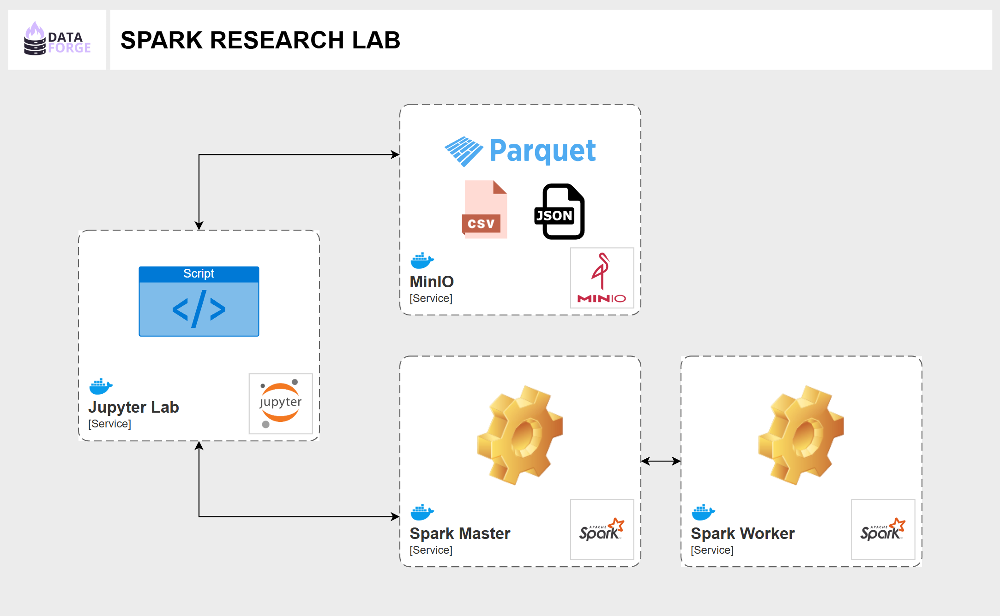

# **DataForge \- Spark Research Lab** 

## **Arquitetura** 



Esta configuração é composta por quatro serviços:

- **Jupyter Lab**: Plataforma iterativa em python que permite escrever e testar código  
- **MinIO**: Uma alternativa local para simular um serviço como o Amazon S3 ou o Google Cloud Storage  
- **Spark**: O Apache Spark segue uma arquitetura mestre-trabalhador. O **Spark Master** gerencia os recursos e atribui tarefas aos **Spark Workers**, que executam os cálculos em paralelo. Essa configuração define dois serviços no Docker Compose para um cluster Apache Spark:  
  - **`spark-master`**: O nó mestre do cluster Spark.  
  - **`spark-worker`**: O nó trabalhador (worker) que executa tarefas distribuídas.  
    

No contexto do Docker Compose, **`spark-master` e `spark-worker` são dois serviços**.

* **Serviço**: No Docker Compose, um serviço é uma definição de como um contêiner deve ser executado (imagem, variáveis de ambiente, volumes, etc.). Ele pode escalar e rodar múltiplos contêineres a partir dessa definição.  
* **Contêiner**: É a instância em execução de um serviço. Quando o Compose inicia um serviço, ele cria um ou mais contêineres com base na configuração definida.  
    
* **`spark-master`** é um **serviço** que inicia um contêiner rodando o Spark no modo "master".  
* **`spark-worker`** é outro **serviço** que inicia um contêiner rodando o Spark no modo "worker".  
* Cada serviço é definido separadamente no **`docker-compose.yml`**, mas pode criar múltiplos contêineres (exemplo: mais de um worker escalando **`docker-compose up --scale spark-worker=3`**).

## **Configurando pyspark.sql.SparkSession no Jupyter Lab** 

```python
        spark = SparkSession.builder \
            .appName(self.app_name) \
            .master(self.spark_master) \
            .config("spark.jars.packages", "org.apache.hadoop:hadoop-aws:3.3.1") \
            .config("spark.hadoop.fs.s3a.endpoint", self.minio_endpoint) \
            .config("spark.hadoop.fs.s3a.access.key", self.access_key) \
            .config("spark.hadoop.fs.s3a.secret.key", self.secret_key) \
            .config("spark.hadoop.fs.s3a.connection.ssl.enabled", "false") \
            .config("spark.hadoop.fs.s3a.path.style.access", "true") \
            .config("spark.hadoop.fs.s3a.impl", "org.apache.hadoop.fs.s3a.S3AFileSystem") \
            .getOrCreate()
```


Este trecho de código cria uma instância do **SparkSession** para permitir operações de processamento de dados no Apache Spark, incluindo a leitura de arquivos armazenados em um sistema S3 compatível, como **MinIO**. Vamos detalhar cada configuração:

### **SparkSession.builder** 

A **SparkSession** é o ponto de entrada unificado para a programação com Apache Spark. O método `.builder` inicializa a configuração do Spark.

### **.appName(self.app\_name)** 

Define o nome da aplicação Spark. Isso é útil para identificar a execução no **Spark UI**.

### **.master(self.spark\_master)** 

Define o **master URL**, que especifica onde o Spark será executado:

- `"local[*]"`: Executa localmente, usando todos os núcleos disponíveis.  
- `"spark://<host>:<port>"`: Conecta-se a um cluster Spark gerenciado. Neste caso ele irá se conectar a um contêiner rodando Spark na porta `spark://spark-master:7077`

## **Configuração para acessar o MinIO/S3 com Hadoop-S3A** 

O Spark não tem suporte nativo para o protocolo **S3**, então o Hadoop fornece um conector chamado **S3A**, que permite ler e gravar dados diretamente em buckets S3. Essas configurações configuram esse acesso.

**.config("spark.jars.packages", "org.apache.hadoop:hadoop-aws:3.3.1")** 

- Adiciona a biblioteca **hadoop-aws** (versão **3.3.1**) para permitir acesso ao **S3A** (o conector Hadoop para S3).

**.config("spark.hadoop.fs.s3a.endpoint", self.minio\_endpoint)** 

- Define o **endpoint** do serviço **S3**.  
- Se estiver usando **AWS S3**, geralmente é `"s3.amazonaws.com"`.  
- Para **MinIO**, utiliza-se a porta onde o container do MinIO é exposto, neste caso `"http://minio:9000"`.

**.config("spark.hadoop.fs.s3a.access.key", self.access\_key)** 

- Configura a **Access Key** para autenticação no serviço S3.

**.config("spark.hadoop.fs.s3a.secret.key", self.secret\_key)** 

- Configura a **Secret Key** para autenticação no serviço S3.

**.config("spark.hadoop.fs.s3a.connection.ssl.enabled", "false")** 

- Define se a comunicação usará **SSL (HTTPS)**.  
- `"true"` → Usará SSL (para AWS S3).  
- `"false"` → Sem SSL (para serviços locais como MinIO).

**.config("spark.hadoop.fs.s3a.path.style.access", "true")** 

- Define o modo de acesso aos objetos no S3.  
- `"true"` → Acessa os objetos com um **path-style**, ou seja, `"http://endpoint/bucket/objeto"`. **Necessário para MinIO.**  
- `"false"` → Usa o estilo **virtual-host**, onde o bucket faz parte do domínio (`"http://bucket.endpoint/objeto"`).

**.config("spark.hadoop.fs.s3a.impl", "org.apache.hadoop.fs.s3a.S3AFileSystem")** 

- Define o **driver de implementação** para acessar arquivos S3 no Hadoop via S3A.  
- O protocolo **S3A** é mais rápido e eficiente do que os antigos **S3** e **S3N**.
  
<br><br>

## **spark.hadoop.fs.s3a** 
O prefixo **spark.hadoop.fs.s3a** indica que essas configurações são relacionadas ao sistema de arquivos **S3A**, que é um conector Hadoop para leitura e gravação em buckets **S3 compatíveis**.

### **Comparação entre S3, S3N e S3A** 

| Protocolo | Suporte a Amazon S3 | Suporte a MinIO | Desempenho | Recomendações |
| :---- | :---- | :---- | :---- | :---- |
| `s3://` | ❌ (antigo) | ❌ | **Ruim** | **Não usar** |
| `s3n://` | ✅ (mas obsoleto) | ❌ | **Médio** | **Obsoleto** |
| `s3a://` | ✅ (atual) | ✅ | **Ótimo** | **Recomendado** |

**Por que usar S3A?** <br>
- Melhor desempenho que `s3n://` e `s3://`.  
- Suporte a autenticação e configuração avançada.  
- Compatível com **AWS S3, MinIO e outros armazenamentos compatíveis**.